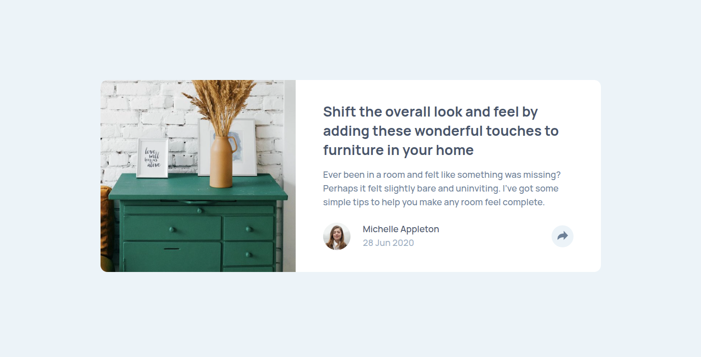

# Frontend Mentor - Article preview component solution

This is a solution to the [Article preview component challenge on Frontend Mentor](https://www.frontendmentor.io/challenges/article-preview-component-dYBN_pYFT). Frontend Mentor challenges help you improve your coding skills by building realistic projects. 

## Table of contents

- [Overview](#overview)
  - [The challenge](#the-challenge)
  - [Screenshot](#screenshot)
  - [Links](#links)
- [My process](#my-process)
  - [Built with](#built-with)
- [Author](#author)

## Overview

### The challenge

Users should be able to:

- View the optimal layout for the component depending on their device's screen size
- See the social media share links when they click the share icon

### Screenshot

### Links

- Solution URL: https://github.com/morning-rgb/Article-Preview-Component
- Live Site URL: https://morning-rgb.github.io/Article-Preview-Component/

## My process

### Built with

- HTML5
- SCSS
- Javascript
- Flexbox
- CSS Grid
- Mobile-first workflow

## Author

- Frontend Mentor - [@morning-rgb](https://www.frontendmentor.io/profile/morning-rgb)
